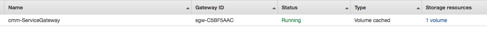
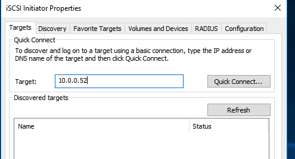
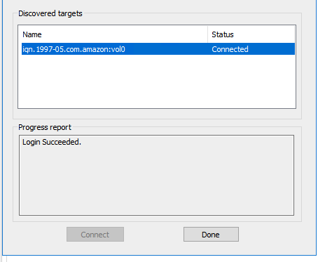
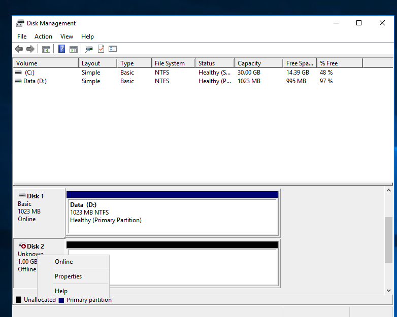
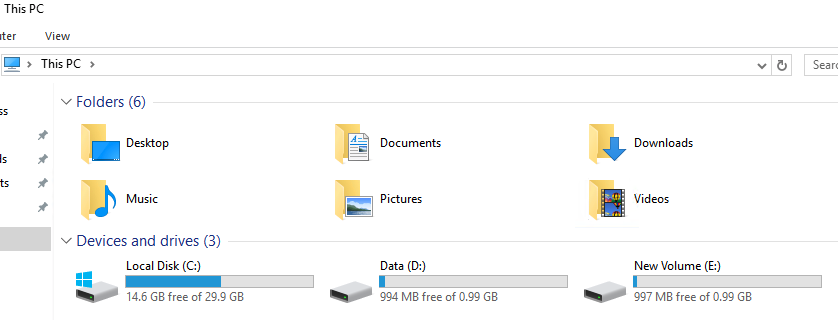
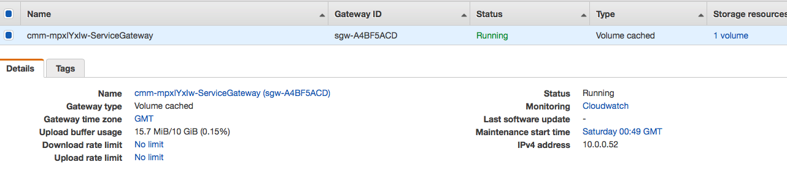
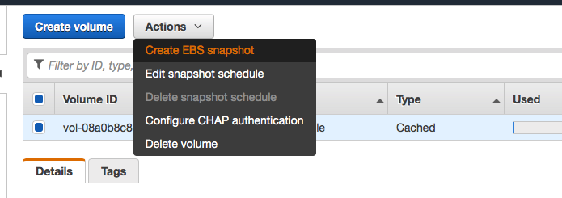

# Storage Gateway and Disaster Recovery Template

## Introduction

The purpose of this project is to create a basic storage gateway configuration with a simulated host environment and gateway using CloudFormation. Optionally, a disaster recovery environment may be used to demonstrate how the Storage Gateway may be used for both a backup and DR solution.

## Step 1 - Create VPC, Simulated Host and a Cached Volume Gateway

Steps to get started:
* **Create EC2 Keys** - Create a set of EC2Keys to be used for the scenario in the AWS us-west-2 Region, but default the CloudFormation scripts create the VPC, simulated host and gateway in us-west-2.
* **Clone Repo** - Clone the repository locally
* **Execute Script** - run ./build-environment.sh to build out the environment

Shell arguments:
```
-n = Stack Prefix, just use your initials, example: cmm
-s = Key name in us-west-2, example: cmm-west-2

Example execution: ./build-environment.sh -n cmm -s cmm-west-2
```
### What is created

The following artifacts are created in AWS:

* a VPC in us-west-2
* A Windows 7 image in us-west-2 (Simulated Host)
* A Linux image in us-west-2 (Storage Gateway)
* A Storage Gateway service in us-east-1

## Step 2 - Configure Simulated host

The host needs to be manually configured. Wait until the storage gateway displays a volume as in the following image:



Once available, connected to your simulated host and perform the following steps:

* Open the iSCSI Initiator (desktop icon), select 'yes' to launch the initiator

* Enter the IP address of your gateway into the Target label and select 'Quick Connect':



* Select the gateway and click the Done button



* Open the Disk Management utility to manage the new disk and mount it



* Once complete, the new disk should be available as E:



* Copy data on drive D: to E:

```
robocopy d: e:
```
## Step 3 - Observe Storage Gateway Operations

The Simulated Host is now connected to the Storage Gateway. The Simulated Host now has data stored on the iSCSI drive hosted by the Storage Gateway.

* Observe the transfer of data from the Simulated Host, through the Storage Gateway to the Storage Gateway Service. Go to the AWS Storage Gateway console and select the Storage Gateway Service. The **Upload buffer usage** property indicates that data has moved from the Simulated Host to Storage Gateway volume.



* Go to the Volumes tab. Note available actions. Let's select **Create EBS snapshot**


